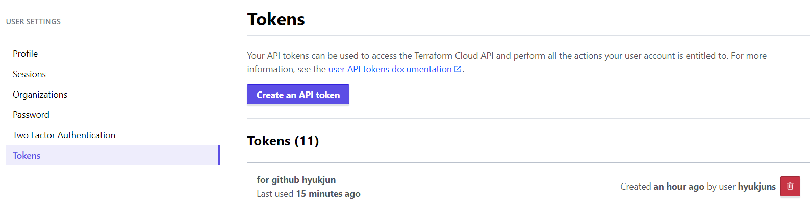
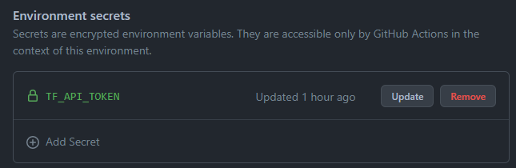
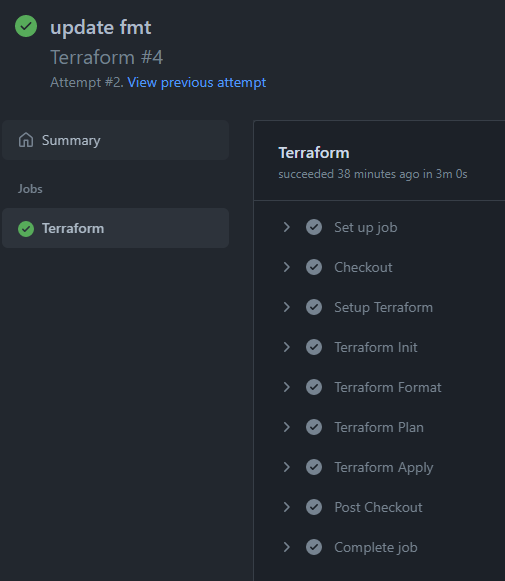
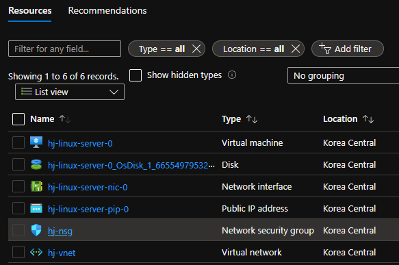

# Terraform Cloud & Github Actions

## Terraform Cloud & Github Actions

Github Actions와 Terraform Cloud를 통해 gitOps를 구현합니다.

## 요약

Github을 통한 테라폼 소스 관리와 동시에 Github Actions를 통해 Terraform Plan & Apply를 수행합니다. <br> 
(실제 Terraform Engine이 실행되는 공간은 Terraform Cloud 입니다.)

## 구성 단계

### Terraform Cloud

- 계정 및 조직 준비
- Workspace 생성
- Azure Credential
    
    ```bash
    ARM_SUBSCRIPTION_ID
    ARM_CLIENT_ID
    ARM_CLIENT_SECRET
    ARM_TENANT_ID
    ```
    

### Github Actions

- Terraform Cloud API Token(TF_API_TOKEN) 환경 변수
    - Github Actions의 Pipeline Agent가 Terraform Cloud를 사용하기 위함
    - 발급 방법
        - Terraform Cloud → User Setting → Tokens
            
            
            
    - ‘TF_API_TOKEN’ 환경 변수 등록
        - 해당 repository → Settings → Environments → 해당 Actions 선택 후 Token 등록
            
            
            
    - YAML 사용
        
        ```bash
            - name: Setup Terraform
              uses: hashicorp/setup-terraform@v1
              with:
                cli_config_credentials_token: ${{ secrets.TF_API_TOKEN }}
        ```
        
- Actions File
    - 기본 Terraform Template 사용
        - 해당 repository → Actions → Choose a workflow 에서 Terraform 검색
    - [별도 구성 필요]
        - working directory 설정 → 테라폼 구성파일의 경로 지정
            
            ```bash
            defaults:
                  run:
                    shell: bash
                    working-directory: <TERRAFORM_WORKDIR>
            ```
            
    - .github/workflows/terraform.yml
        
        ```bash
        name: 'Terraform'
        
        on:
          push:
            branches:
            - main
          pull_request:
        
        jobs:
          terraform:
            name: 'Terraform'
            runs-on: ubuntu-latest
            environment: production
        
            # Use the Bash shell regardless whether the GitHub Actions runner is ubuntu-latest, macos-latest, or windows-latest
            defaults:
              run:
                shell: bash
                working-directory: azure-vm
        
            steps:
            # Checkout the repository to the GitHub Actions runner
            - name: Checkout
              uses: actions/checkout@v2
        
            # Install the latest version of Terraform CLI and configure the Terraform CLI configuration file with a Terraform Cloud user API token
            - name: Setup Terraform
              uses: hashicorp/setup-terraform@v1
              with:
                cli_config_credentials_token: ${{ secrets.TF_API_TOKEN }}
        
            # Initialize a new or existing Terraform working directory by creating initial files, loading any remote state, downloading modules, etc.
            - name: Terraform Init
              run: terraform init
        
            # Checks that all Terraform configuration files adhere to a canonical format
            - name: Terraform Format
              run: terraform fmt -check
        
            # Generates an execution plan for Terraform
            - name: Terraform Plan
              run: terraform plan
        
              # On push to main, build or change infrastructure according to Terraform configuration files
              # Note: It is recommended to set up a required "strict" status check in your repository for "Terraform Cloud". See the documentation on "strict" required status checks for more information: https://help.github.com/en/github/administering-a-repository/types-of-required-status-checks
            - name: Terraform Apply
              if: github.ref == 'refs/heads/main' && github.event_name == 'push'
              run: terraform apply -auto-approve
        ```
        

### 실행

- Github Actions
    
    
    
- Terraform Cloud
    
    
    
- Azure
    
    